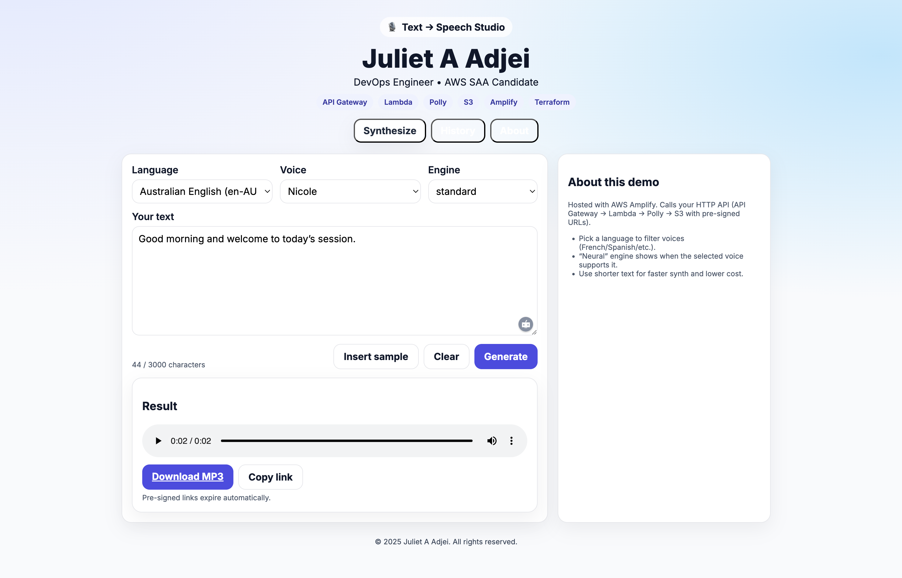
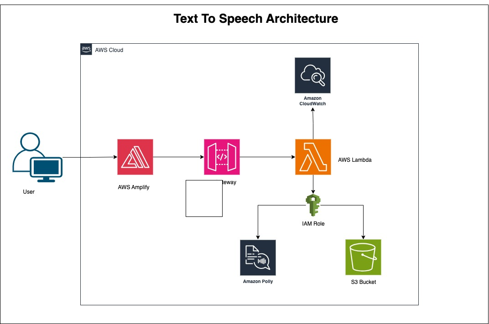
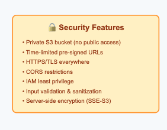
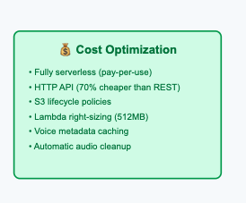
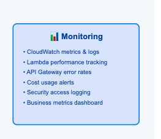

# Serverless Text-to-Speech Platform

A secure, scalable serverless TTS platform built on AWS that transforms text into high-quality audio using Amazon Polly.


## 🏗️ Architecture



The platform uses a fully serverless architecture with these core components:

- **Frontend**: React SPA hosted on AWS Amplify
- **API**: HTTP API Gateway with Lambda backend
- **Processing**: Python Lambda function integrating with Amazon Polly
- **Storage**: Private S3 bucket with time-limited pre-signed URLs
- **Security**: IAM roles with least privilege access

### Data Flow
1. **User Input** → React UI captures text and voice preferences
2. **API Request** → HTTP API validates and routes to Lambda
3. **Speech Synthesis** → Lambda calls Polly for audio generation
4. **Secure Storage** → Audio saved to private S3 with organized prefixes
5. **Temporary Access** → Pre-signed URL generated with configurable TTL
6. **User Download** → Direct S3 access via time-limited secure link

## 🚀 Quick Start

### Prerequisites
- AWS CLI configured
- Terraform >= 1.5.0
- Node.js >= 18
- Git repository access

### Deployment

1. **Deploy Infrastructure**
   ```bash
   cd infra
   terraform init
   terraform apply
   ```

2. **Deploy Frontend**
   ```bash
   cd TTS-web
   npm install
   npm run build
   # Connect to Amplify via console or CLI
   ```

3. **Test API**
   ```bash
   # Get available voices
   curl https://your-api-id.execute-api.region.amazonaws.com/voices
   
   # Synthesize speech
   curl -X POST https://your-api-id.execute-api.region.amazonaws.com/synthesize \
     -H "Content-Type: application/json" \
     -d '{"text":"Hello world","voice":"Joanna","engine":"neural"}'
   ```

## 📁 Project Structure

```
Project-Azubi/
├── documents/                # Documentation and images
│   └── images/
│       └── architecture-diagrams.svg
├── backend/                  # Lambda function code
│   ├── lambda_function.py
│   ├── requirements.txt
│   └── tests/
├── infra/                    # Terraform infrastructure
│   ├── lambda/               # Copy of lambda code
│   │   ├── lambda_function.py
│   │   └── requirements.txt
│   ├── amplify-hosting.tf
│   ├── apigateway.tf
│   ├── iam.tf
│   ├── lambda.tf
│   ├── main.tf
│   ├── outputs.tf
│   ├── s3.tf
│   ├── ssm.tf
│   └── variables.tf
├── TTS-web/                  # React frontend application
│   ├── public/
│   ├── src/
│   ├── .env
│   ├── .gitignore
│   ├── package.json
│   ├── README.md
│   └── vite.config.js
└── README.md                 # Main project documentation
```

## 🔧 API Endpoints

### GET /voices
Returns available Polly voices with metadata.

**Query Parameters:**
- `lang` (optional): Filter by language code

**Response:**
```json
{
  "voices": [
    {
      "id": "Joanna",
      "name": "Joanna", 
      "languageCode": "en-US",
      "gender": "Female",
      "supportedEngines": ["standard", "neural"]
    }
  ]
}
```

### POST /synthesize
Converts text to speech and returns secure audio URL.

**Request:**
```json
{
  "text": "Hello world!",
  "voice": "Joanna",
  "engine": "neural"
}
```

**Response:**
```json
{
  "url": "https://bucket.s3.amazonaws.com/audio/uuid.mp3?X-Amz-...",
  "key": "audio/2025/09/18/abc123.mp3",
  "expiresAt": "2025-09-18T15:30:00Z"
}
```

## 🔒 Security Features

- **Private S3 Storage**: No public bucket access
- **Time-Limited URLs**: Pre-signed URLs expire after 1 hour (configurable)
- **HTTPS Everywhere**: TLS 1.2+ for all communications
- **Input Validation**: Comprehensive request sanitization
- **IAM Least Privilege**: Prefix-scoped S3 permissions
- **CORS Protection**: Restricted origins and methods



## 💰 Cost Estimates

**Low Usage** (100 requests/month):
- Total: ~$8/month

**Medium Usage** (10,000 requests/month):
- Total: ~$252/month
- Primary cost: Amazon Polly character processing




## 📊 Monitoring

Key metrics tracked via CloudWatch:
- Lambda duration and errors
- API Gateway response codes
- Polly synthesis success rate
- S3 storage and bandwidth usage



## 🔧 Configuration

### Environment Variables

**Lambda Function:**
```bash
ARTIFACTS_BUCKET=tts-artifacts-{env}
AUDIO_PREFIX=audio/
PRESIGN_TTL=3600
LOG_LEVEL=INFO
```

**Frontend:**
```bash
VITE_API_BASE=https://api-id.execute-api.region.amazonaws.com
VITE_MAX_TEXT_LENGTH=3000
```

### Terraform Variables

```hcl
project_name = "tts"
environment = "dev"
aws_region = "us-east-1"
presign_url_ttl = 3600
```

## 🐛 Troubleshooting

### Common Issues

**CORS Errors**
- Verify Amplify URL in API Gateway CORS settings
- Check for trailing slashes in API calls

**Lambda Timeouts**
- Increase timeout setting (current: 30s)
- Check CloudWatch logs for bottlenecks

**S3 Access Denied**
- Verify IAM policy includes correct bucket ARN
- Ensure object exists before generating pre-signed URL

### Monitoring Commands

```bash
# Check API Gateway logs
aws logs filter-log-events --log-group-name API-Gateway-Execution-Logs

# Check Lambda logs
aws logs filter-log-events --log-group-name /aws/lambda/tts-synthesizer

# Check S3 bucket contents
aws s3 ls s3://tts-artifacts-dev/audio/ --recursive
```

## 🔮 Roadmap

- [ ] Batch text processing
- [ ] Custom voice training integration
- [ ] Advanced SSML editor
- [ ] Real-time streaming synthesis
- [ ] Multi-tenant architecture
- [ ] Analytics dashboard

## 🤝 Contributing

1. Fork the repository
2. Create a feature branch
3. Make your changes
4. Add tests
5. Submit a pull request

## 📄 License

MIT License - see LICENSE file for details.

---

**Maintained by:** Juliet A. Adjei  
**Last Updated:** September 18, 2025